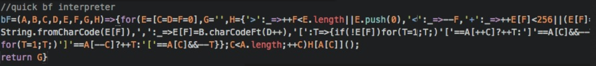

## The Basis of Programming

In the world of programming, every programmer has their own preference in coding style. As a programmer, I have seen code where everything is written into one line and where everything is double-spaced or even triple-spaced! How can we solve such a trivial problem? Coding standards. Although it may vary depending on the language or course, it is extremely helpful to the programmer themselves. Coding standards provides a set of rules and guidelines that will organize code to be more maintainable and readable to all. 

## Bad Coding Example
Here is an example of what bad coding style may seem: 

When it comes to coding standards, one of the most essential aspects is readability. A friend of mine asked me to review his code. I proceeded and noticed that everything that was typed had no indentations. It may only be understandable to the programmer but to everyone else, it made no sense. When speaking about readability, it is important to have other people, which may include teammates, employers, and yourself, to be able to comprehend what the code means. Another addition about coding in coding standards is the maintainability. Being able to write and update code without losing track is helpful to the programmer whenever the code needs to be changed.

## Personal Impression and Insight

The first time I was coding while following the coding standards, I felt no importance towards it. Missing a space, or unaligned curly brace was not an issue. As time and experience grows, following coding standards is an absolute must. It simply made code writing a lot more comfortable and overall, more time efficient. Recently, I have been using ESLint with Intellij. The coding standards felt new, especially the green checkmark which determines if any code violates the coding standard rules. However, it enforced the idea of having readable code along with the satisfaction of the green checkmark. Throughout my experiences as a programmer, I believe following coding standards is an essential habit to pursue as a software developer.
