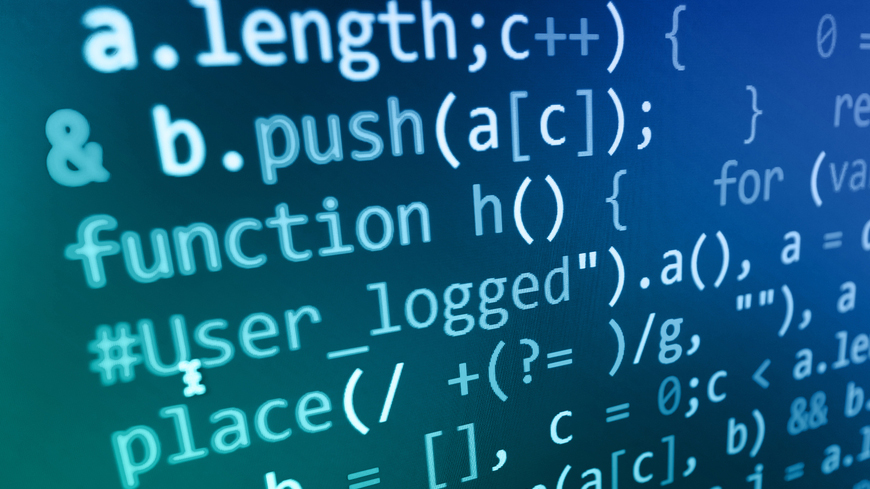

## Curiosity in Software Engineering

My interests of software engineering began when I was a young boy in the early 2000s, it was always about playing online games. The graphics and how the game functions had me wondered how it was possible to implement them. Years later, games had advanced in complexity, so does mathematics and algorithms that had caught my interest as well. Another interest I have is cyber security which sprung from CyberPatriot. There were so many topics to learn ranging from application to network security. I simply want to do my best to protect our society from cyberattacks. 

## Future Skills and Experiences

Skills that I hope to develop in the future are skillsets for cyber security such as data analysis, forensics, etc. Having these skills are essential when learning about cybercrime. Throughout my CyberPatriot practices, my team had to constantly defend against the attacker from controlling our system. It was a fun experience mainly because it was happening in real-time. I also want to try pen testing and reverse engineering that would expand my overall knowledge about the cybersecurity world.

Another type of skill I hope to develop are algorithms, in general, because I find it important for  programs and logic to be the most optimal. Formulating algorithms with the least runtime and space are needed as fundamental blocks to have more efficient logical problem solver in the future. This could be something simple like iterating a bit string of 0s and 1s that will count the number of 1s with a runtime faster than n-times. In the future, I would like to experience a project that would include both aspects of algorithm and program implementation. This would better visualize the algorithm differences and overall, sharpening my algorithm solving skillset. 

