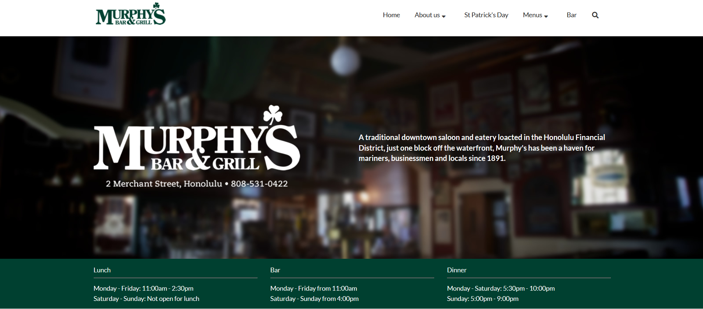

## The Benefits of Semantic UI

When creating and designing websites, its usually either raw HTML or UI Frameworks. Simply using raw HTML would take days to make a potentially attractive webpage. Instead, I tried learning a UI framework to draw some comparisons. The UI framework that I experienced in is Semantic UI, which is software tools/framework used for building webpage. The first aspect I encountered was its uniqueness in using natural language, meaning it is similar to English. This can provide a more intuitive language on how to use their tools. Another benefit in using semantic UI is the concise amount of HTML typed. Having the option of premade classes helps to have an organized formatting style along with built-in design. For example, Semantic UI has a “container” class for page margins and a “grid” class for designing how things are placed. Additionally, the reduced amount HTML code allows us to have an easier time tracing and debugging code.

## My Experience and Insight
My first experience in HTML begins without any UI Frameworks. Our first task involved formatting paragraphs into three columns. With raw HTML, each paragraph was wrapped in a div, then in CSS, it was assigned to either float left or float right. Although it did work, the three-column formatting was altered every time the window size is changed. Afterwards, I recreated the same task, but with Semantic UI. My code wrapped the three paragraphs using “ui equal width grid” class and within each paragraph, it has another class using “ui column”. The amount of HTML was less, and the design format was what I needed. 

Below is another one of my assignment using Semantic UI.

Overall, I would say using Semantic UI or any UI frameworks made my experience working with webpages easier and more time efficient, especially when compared to raw HTML. The only potential drawback is learning about how each UI framework operates. However, the benefits of using UI Frameworks will be worthwhile when working on projects.
